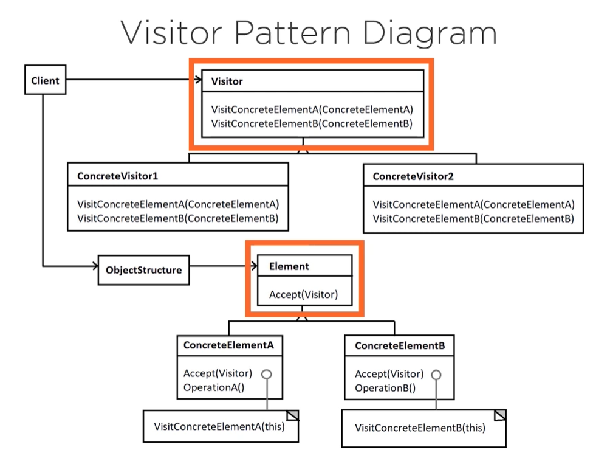

# Design Patterns

## Behavioral

### Visitor

Create Visitor Blueprint
Then implement concrete classes

Visitor is behavioral because it focuses on communication between objects.

Represents an operation to be performed on the elements of an object structure without changing the classes of the elements on which it operates.

* Behavior can be added to existing hierarchy.
  - No changes to underlying classes
* Behavior is class-specific
* No hierarchical connection is necessary
  - as long as classes are marked as visitable.

Visitor Pattern diagram:
  

This design pattern might be useful when:

  _"When a project has several different classes, with different interfaces, that need additinal behavior without changing their underlying structure"_

#### Adding Object structure

An object structure is the main control panel for the visitor pattern, allowing you to store and modify an iterable collection of visitable elements.

"You're not always going to see it, but I encourage you to use it as an extra level of abstraction"

--> See code example

#### Use cases and applications

CASES

* Not always
* When a project has a variety of classes, with different interfaces and inheritance structures, that need added class-specific behavior
* When different and unrelated behavoirs need to be applied without polluting the existing classes.
* When existing class structure is unlikely to change, but new behavior needs to be added at will

IMPLICATIONS

* Adding behavior across a wide range of differing existing classes
* Gathering related behaviors and accumulated state across differing classes.

DRAWBACKS
* Changing  hierarchy might be costly, because it would imply changing the visitor interface and implementations.
* Encapsulation could be broken, because this pattern often need access to private classes.
